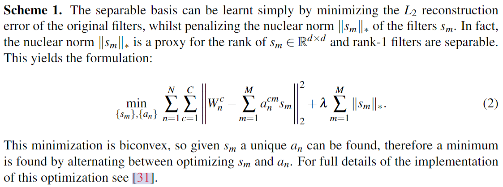

# Speeding up Convolutional Neural Networks with Low Rank Expansions

## Scheme1

|     app      |  src-layer  |     tgt-layer      |   status   |
|:------------:|:-----------:|:------------------:|:----------:|
| `LowRankExp` | `nn.Conv2d` | `LowRankExpConvV1` | :confused: |

> Use SVD we can get the analytical solution to the object above, while the alternating method make it converge to a local minimum slowly. I also use my code to verify this.

### LowRankExpV1 对 AlexNet 在 CIFAR 10上的实验

L2 finetune 固定配置：

- 使用`AdamW`优化器，`lr=1e-4, momentum=0.9, weight_decay=0.01`
- 不使用scheduler；
- 微调20个epoch，选择准确率最高的；
- 除了被替换层的参数，其他层的参数在微调过程中均被冻结；

CE finetune 固定配置：
- 使用`AdamW`优化器，`lr=1e-4, momentum=0.9, weight_decay=0.01`
- 不使用scheduler；
- 微调10个epoch，选择准确率最高的；
- 不冻结任何参数
- 本实验中，CE和L2同时使用的方法是先用L2微调完之后，再用CE微调；

模型统计固定配置：
- 使用`ptflops`；

推理时间固定配置：

- 使用 `torch.profile`，输入尺寸`(64, 3, 224, 224)`；

|No.|layers|#bases|decomped|L2 finetune|CE finetune|acc@1(%)|macs(M)|params(M)|CPU time(ms)|CUDA time(ms)|Remark|
|:---:|:---:|:---:|:---:|:---:|:---:|:---:|:---:|:---:|:---:|:---:|:---:|
|1|-|-|-|-|-|83.14|698.89|44.43|1265|6.605|原始模型|
|
|2|2,3,4,5|8,8,6,4|-|-|-|77.43|446.85|43.58|1254|10.112|在原模型基础上应用LowRankExpV1方法，但是最后不分解|
|3|2,3,4,5|8,8,6,4|-|1.0x20|0.0|72.67|-|-|-|-|准确率从77.43掉到72.67，但是L2 norm从1952减少到177|
|4|2,3,4,5|8,8,6,4|-|1.0x20|1.0x10|82.35|-|-|-|-|准确率从72.67稳定升到82.35，L2 norm从177增加到783|
|5|2,3,4,5|8,8,6,4|-|0.0|1.0x10|82.27|-|-|-|-|准确率从77.43升到82.27，L2  norm从1952增加到2340|
|
|6|2,3,4,5|8,8,6,4|Y|-|-|71.04|437.59|43.56|1277|12.235|在2的结果上直接应用空间低秩分解，准确率从77.43掉到71.04|
|7|2,3,4,5|8,8,6,4|Y|1.0x20|0.0|71.70|-|-|-|-|与6相比，准确率提升了0.66，L2 norm从1865降到171|
|8|2,3,4,5|8,8,6,4|Y|1.0x20|1.0x10|82.26|-|-|-|-|准确率从71.70提升到82.26，L2 norm从171增加到695|
|9|2,3,4,5|8,8,6,4|Y|0.0|1.0x20|81.82|-|-|-|-|准确率从71.04提升到81.82，L2 norm从1865增加到2070|

对比1/2/6，该论文提出的scheme1方法即使使用分组卷积实现，效率也仍然不如传统卷积（可以高度并行化，且对3x3有专门的加速算法），只能减少计算量；

对比3/4/5，或者对比7/8/9，似乎可以证明的一个结论是，尽管只使用L2 norm进行微调会损害性能，但是让分解后模型“靠近”原模型的收敛位置，似乎有助于接下来使用CE loss的微调；这里存在着L2目标和CE目标的trade-off，人为的设置交替微调，或者设置权重，都只是收敛到某一个Pareto optimal罢了；

